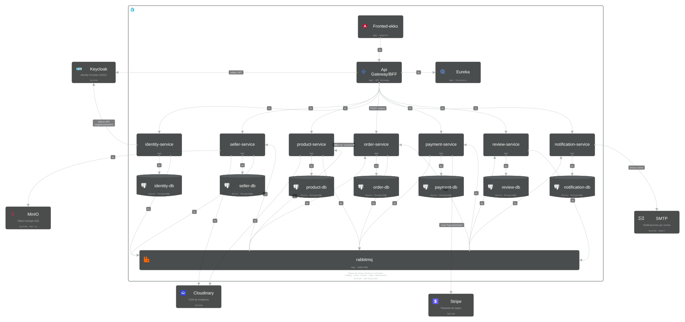

# Ekko

Ekko es una plataforma de e-commerce multi-vendedor que resuelve el flujo completo de un marketplace: registro y catálogo independiente por vendedor, reserva de inventario, checkout con liquidación individual vía Stripe Connect, y comunicación desacoplada entre servicios mediante eventos. Está construida con una arquitectura de microservicios en Java y Spring Boot, coordinada por un API Gateway.

## Arquitectura

El sistema está compuesto por microservicios independientes que se comunican de forma síncrona (REST vía Feign) y asíncrona (eventos vía RabbitMQ), coordinados a través de un API Gateway que actúa como Backend for Frontend (BFF).



Diagrama interactivo: [IcePanel](https://s.icepanel.io/ZthmG6qMlCbyqv/aQH9)

- **Descubrimiento de servicios:** Eureka
- **Gateway:** Spring Cloud Gateway (puerto 8080), TokenRelay, Resilience4j CircuitBreaker, rate limiting con Redis
- **Autenticación y autorización:** Keycloak (OAuth2/OIDC), roles vía `realm_access.roles`
- **Comunicación asíncrona:** RabbitMQ (patrón DLQ, outbox pattern en `identity-service`)
- **Pagos:** Stripe Connect (separate charges and transfers)
- **Almacenamiento:** Cloudinary (imágenes), MinIO (documentos)
- **Persistencia:** PostgreSQL (enums nativos, UUID como PK)

Las decisiones de arquitectura están documentadas mediante un conjunto de ADRs (Architecture Decision Records) que cubren, entre otros temas: justificación de microservicios, UUID como PK, Saga por coreografía, integración con Stripe Connect, mensajería con RabbitMQ, migraciones con Flyway, uso de enums de PostgreSQL, arquitectura hexagonal selectiva, integración con Keycloak, comunicación REST + eventos, y el rol de Spring Cloud Gateway y Eureka.

## Microservicios

| Servicio | Responsabilidad |
|---|---|
| `identity-service` | Registro de usuarios en Keycloak, gestión de credenciales, verificación de email, cambio de contraseña con step-up auth |
| `seller-service` | Gestión de perfiles y datos de negocio de vendedores |
| `product-service` | Catálogo de productos, inventario, categorías |
| `order-service` | Orquestación de pedidos (arquitectura hexagonal) |
| `payment-service` | Procesamiento de pagos vía Stripe Connect (arquitectura hexagonal) |
| `review-service` | Reseñas de productos |
| `notification-service` | Notificaciones por email e in app |
| `api-gateway` | Punto de entrada único, enrutamiento, seguridad, resiliencia |
| `eureka-server` | Registro y descubrimiento de servicios |

## Stack tecnológico

**Backend**
- Java 21
- Spring Boot, Spring Cloud Gateway, Spring Security (OAuth2)

**Datos y mensajería**
- PostgreSQL
- RabbitMQ
- Redis

**Identidad y seguridad**
- Keycloak

**Infraestructura**
- Docker, Docker Compose

**Pagos y almacenamiento**
- Stripe Connect
- Cloudinary, MinIO

## Funcionalidades clave

**Identidad y seguridad**
- Registro diferenciado por rol (comprador, vendedor, administrador), con reglas de negocio propias para cada uno.
- Verificación de email y autenticación reforzada (step-up auth) obligatoria para operaciones sensibles como el cambio de contraseña.
- Bloqueo a nivel de Gateway de operaciones de escritura para usuarios sin email verificado.
- Comunicación interna entre servicios autenticada vía client credentials, sin depender de tokens de usuario.

**Catálogo e inventario**
- Gestión de catálogo por vendedor: productos, variantes, categorías con detección de ciclos.
- Control de inventario con bloqueo pesimista para evitar sobreventa en condiciones de concurrencia.

**Pedidos y pagos**
- Flujo completo de pedidos con reserva de inventario y orquestación mediante Saga por coreografía.
- Procesamiento de pagos vía Stripe Connect con liquidación independiente por vendedor.
- Manejo explícito de estados de pago (creado, iniciado, cancelado) con protección de datos sensibles según el estado.

**Resiliencia y observabilidad**
- Circuit breakers configurados por servicio en el Gateway, con endpoints de fallback.
- Colas de mensajes muertos (DLQ) para eventos que fallan en su procesamiento.
- Health checks vía Spring Boot Actuator en todos los servicios, usados para orquestar el arranque en Docker Compose.
- Balanceo de carga real entre múltiples instancias vía Eureka y rate limiting a nivel de Gateway.

**Notificaciones y reseñas**
- Notificaciones por email e in app basadas en eventos del sistema, con plantillas configurables.
- Sistema de reseñas de productos.

## Cómo ejecutar el proyecto

### Requisitos previos

- Docker y Docker Compose
- Variables de entorno configuradas (Keycloak, Stripe, Cloudinary, MinIO)

### Levantar el sistema

```bash
docker-compose up --build
```

Docker Compose orquesta el arranque de todos los servicios respetando dependencias mediante `condition: service_healthy`, verificado a través de Spring Boot Actuator en cada microservicio.

## Estructura del repositorio

Este es un monorepo: todos los microservicios, el API Gateway y el servidor de descubrimiento viven en un único repositorio, cada uno en su propio módulo.

```
ekko/
  -  api-gateway/
  - eureka-server/
  - identity-service/
  - seller-service/
  - product-service/
  - order-service/
  - payment-service/
  - review-service/
  - notification-service/
  - docker-compose.yml
```

## Documentación adicional

Documentación técnica y decisiones de arquitectura (ADRs): [Documentación técnica](https://andersondiaz15.atlassian.net/wiki/external/MDhhMDAyMGJlZjNkNGU2NGJlM2U3ZTY4NmJiZGZkMTY)

## Roadmap

- [x] Servicios de dominio (identidad, vendedores, productos, pedidos, pagos, reseñas, notificaciones)
- [x] Comunicación síncrona y asíncrona entre servicios
- [x] Gateway como punto único de entrada, con seguridad y resiliencia
- [x] Balanceo de carga y rate limiting validados en Docker
- [ ] Frontend
- [ ] Observabilidad centralizada (logs, métricas, trazas)
- [ ] Despliegue en entorno cloud

## Licencia

Este proyecto está bajo la licencia MIT. Consulta el archivo [LICENSE](LICENSE) para más detalles.